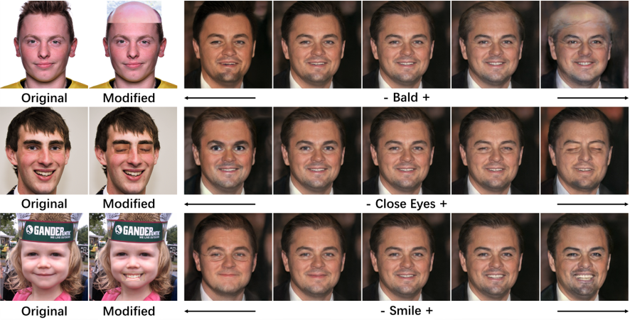
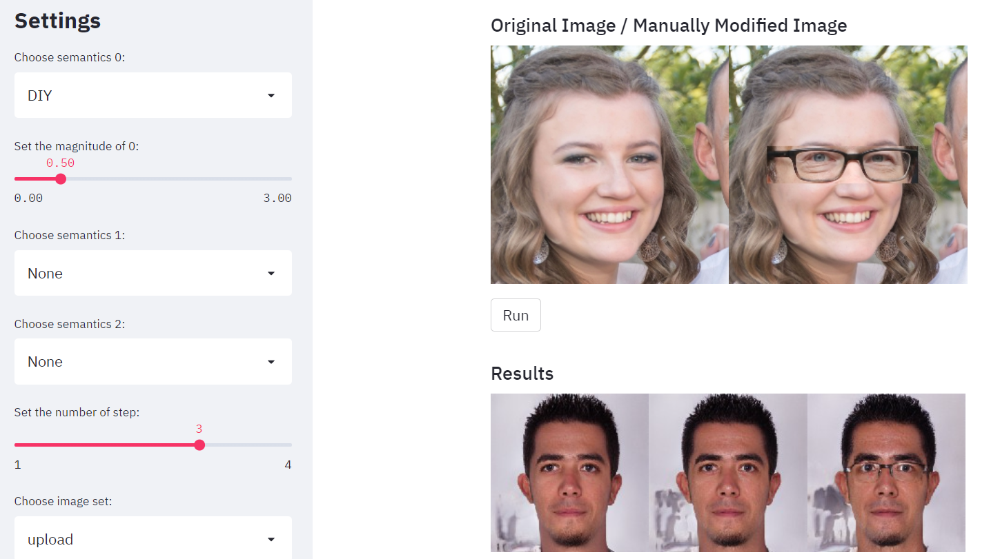

# Real Image Editing on User-Specified Semantics by GAN Inversion model



**Figure:** *Example which is showing the satisfying real image editing achieved by our application.*

This is a shared repository for 2021 Spring Computer Vision course project, which implements a compact application to do real image editing. Our application takes advantage of pre-trained GANs and corresponding inversion models. Taking only one pair of images as input, it can find user-defined semantic directions efficiently and with high accuracy, compared with previous approaches. These directions can then be applied on inverted latent codes and editing certain semantics of real images. See final report [there](./CV_FinalReport_Direction_in_GAN_Latent_Space.pdf).

The application is implemented mainly on StyleGAN2 and [FFHQ](https://github.com/NVlabs/ffhq-dataset), the inversion model we use is the [in-domain](https://github.com/genforce/idinvert_pytorch) inversion model.

## Let's play!

To play with our application, just clone this repository to your machine and run the following bash:
```bash
streamlit run interface.py
```
The application will download the pre-trained GAN and inversion model automatically, then one can edit their own real images on either pre-determined or user-specified semantics.


**Figure:** *The main interface of our application, which is implemented by streamlit*
